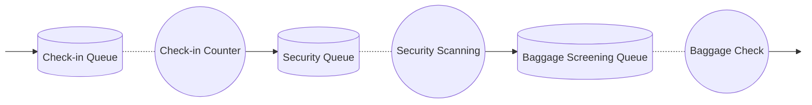
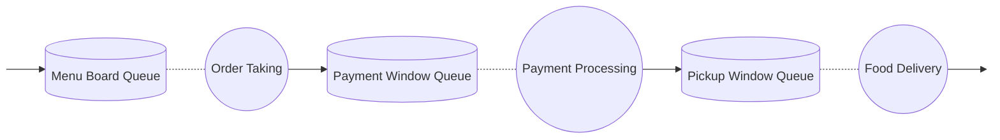

# Simulation Performance Variables - Assignment Solutions

## Task 1: Performance Measures Example - Hospital Emergency Department

Using a **hospital emergency department** as our example system:

### Directly Observable Variables:
- **A (Arrival Count)**: Number of patients who have arrived at the emergency department during the simulation period
- **C (Completed Count)**: Number of patients who have been fully treated and discharged from the emergency department
- **B (Busy Time)**: Total time doctors/nurses have been actively treating patients (not idle)
- **T (Total Simulation Time)**: Total duration of the simulation (e.g., 8 hours, 24 hours)

### Derived Variables:
- **U (Utilization)**: Percentage of time medical staff are busy treating patients vs. idle time
  - U = B/T (e.g., if doctors are busy 6 hours out of 8, U = 0.75 or 75%)
- **X (Throughput)**: Rate at which patients are successfully treated and discharged
  - X = C/T (e.g., 20 patients treated in 8 hours = 2.5 patients/hour)
- **S (Service Time)**: Average time spent actually treating each patient (excluding waiting)
  - S = B/C (e.g., if total treatment time is 6 hours for 20 patients, S = 18 minutes/patient)

### Additional Observable Variables:
- **Ri (Individual Response Time)**: Time from when patient i arrives until they leave the hospital
- **W (Total Waiting Time)**: Sum of all patients' response times

### Final Derived Variables:
- **R (Average Response Time)**: Average time patients spend in the hospital (waiting + treatment)
  - R = W/C (critical metric for patient satisfaction)
- **N (Average Queue Length)**: Average number of patients in the system at any time
  - N = W/T (helps determine staffing needs)

## Task 2: Performance Measure Categories

Performance measures can be categorized by **when and where** they are maintained:

### Service Point Level Measures:
- **Maintained continuously during simulation**: U (utilization), B (busy time)
- **Updated when service begins**: Service start events
- **Updated when service ends**: C (completed count), S (service time)
- **Calculated at end of simulation**: Final utilization, throughput rates

### Customer Level Measures:
- **Set when customer arrives**: Arrival timestamp for Ri calculation
- **Updated when customer enters service**: Waiting time calculation
- **Finalized when customer leaves**: Individual response time Ri, contribution to W

### System Level Measures:
- **Continuously tracked**: T (simulation time), N (queue length)
- **Accumulated throughout**: A (arrival count), W (total waiting time)
- **Calculated periodically or at end**: System-wide averages and totals

## Task 3: Two Real-World Systems

### System 1: Airport Security Checkpoint


**Real-world concepts:**
- **Check-in Counter**: Verify tickets and ID, issue boarding passes
- **Security Scanning**: X-ray screening, metal detector, pat-downs
- **Baggage Check**: Additional screening for flagged luggage
- All passengers must complete all three stages before reaching their gate

### System 2: Fast Food Restaurant Drive-Through


**Real-world concepts:**
- **Order Taking**: Customer places order at menu board/speaker
- **Payment Processing**: Customer pays at first window
- **Food Delivery**: Customer receives prepared food at pickup window
- Sequential process ensures order accuracy and payment collection

## Task 4: Main Simulator Loop Algorithm

```java
// Three-Phase Simulation Main Loop
public void runSimulation() {
    initializeSimulation();
    
    while (simulationTime < endTime && !terminationCondition()) {
        
        // PHASE A: Advance time to next event
        Event nextEvent = eventCalendar.getNextEvent();
        simulationTime = nextEvent.getTime();
        
        // PHASE B: Execute all events scheduled for current time
        while (eventCalendar.hasEventsAt(simulationTime)) {
            Event currentEvent = eventCalendar.removeNextEvent();
            processEvent(currentEvent);
        }
        
        // PHASE C: Check for state-dependent activities
        // (Activities that can start immediately due to current state)
        for (ServicePoint servicePoint : servicePoints) {
            servicePoint.tryStartService(); // Start service if queue has customers and server is free
        }
        
        // Update statistics and performance measures
        updateStatistics();
    }
    
    // Final calculations and report generation
    calculateFinalStatistics();
    generateReport();
}
```

## Task 5: Simulator Class Event Coding

### A-Phase Coding (Time Advancement):
```java
public class EventCalendar {
    // A-phase: Advance simulation time
    public Event getNextScheduledEvent() {
        // Find earliest scheduled event
        // Update simulation clock to event time
        // Remove and return the event
    }
}
```
**Meaning**: Manages the simulation clock by finding the next scheduled event and advancing time.

### B-Phase Coding (Event Processing):
```java
public abstract class Event {
    // B-phase: Execute scheduled events
    public abstract void processEvent();
}

public class ArrivalEvent extends Event {
    public void processEvent() {
        // Create new customer
        // Add customer to appropriate queue
        // Schedule next arrival event
        // Update arrival statistics (A++)
    }
}

public class DepartureEvent extends Event {
    public void processEvent() {
        // Remove customer from service
        // Update completion statistics (C++)
        // Calculate customer's response time
        // Free up the service point
    }
}
```
**Meaning**: Executes all events scheduled for the current simulation time, changing system state.

### C-Phase Coding (Conditional Activities):
```java
public class ServicePoint {
    // C-phase: Start activities that can begin immediately
    public void checkAndStartService() {
        if (!isServerBusy() && !queue.isEmpty()) {
            Customer customer = queue.removeFirst();
            startService(customer);
            scheduleServiceCompletion(customer);
            // Update busy time statistics
        }
    }
}
```
**Meaning**: Checks current system state and immediately starts any activities that can begin (like starting service for waiting customers when servers become available).
